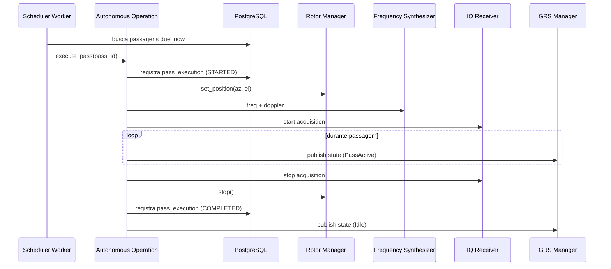

# Camadas da aplicação

> **Documento histórico.** Descreve o MGM8 como ele foi desenhado, antes do
> split em repositórios. Cita módulos que já não existem (`pass_scheduler.py`,
> `api/`, os repositórios em memória): eram um agendamento paralelo ao do TC
> Scheduler, que nenhum processo subia, e foram removidos.
>
> A arquitetura hexagonal descrita aqui **continua valendo** para o Station
> Manager — ver `nanosat-gs/grs-station-manager`. O que mudou foi o escopo: o
> agendamento saiu daquele serviço e mora no TC Scheduler.


O MGM8 segue uma **arquitetura hexagonal (ports & adapters)** com separação clara entre domínio, aplicação e infraestrutura. A comunicação externa é predominantemente **ZeroMQ** (Pub/Sub para streaming, Req/Rep para comandos síncronos).

## Diagrama de camadas

```mermaid
flowchart TB
    subgraph AdaptersIn["Adapters de entrada"]
        ZMQIn["ZMQ Subscriber / REP"]
        GRSAdapter["GRS Manager Adapter"]
        SchedulerTrigger["Scheduler Trigger (cron/async)"]
        HealthPoller["Health Poller"]
    end

    subgraph Application["Camada de aplicação (Use Cases)"]
        MsgRouter["Message Router"]
        PassScheduler["Pass Scheduler Service"]
        TCScheduler["TC Scheduler Service"]
        AutoOps["Autonomous Operation Service"]
        StatePublisher["State Publisher"]
        ConfigService["Configuration Service"]
        EventLogger["Event Logger"]
    end

    subgraph Domain["Camada de domínio"]
        Pass["ScheduledPass"]
        Telecommand["ScheduledTelecommand"]
        StationState["StationState"]
        ApplicationRegistry["ApplicationRegistry"]
        ConflictDetector["SchedulingConflictDetector"]
        ProtocolTranslator["Protocol Translator (interface)"]
    end

    subgraph AdaptersOut["Adapters de saída"]
        ZMQOut["ZMQ Publisher / REQ"]
        SSAdapter["Station Server Adapter"]
        PGRepo["PostgreSQL Repositories"]
        GRSNotify["GRS State Notifier"]
    end

    ZMQIn --> MsgRouter
    GRSAdapter --> MsgRouter
    SchedulerTrigger --> PassScheduler
    SchedulerTrigger --> TCScheduler
    HealthPoller --> ApplicationRegistry

    MsgRouter --> ProtocolTranslator
    MsgRouter --> SSAdapter
    PassScheduler --> Pass
    TCScheduler --> Telecommand
    AutoOps --> PassScheduler
    AutoOps --> TCScheduler
    AutoOps --> SSAdapter
    StatePublisher --> StationState
    ConfigService --> StationState
    EventLogger --> PGRepo

    Pass --> ConflictDetector
    Telecommand --> ConflictDetector
    PassScheduler --> PGRepo
    TCScheduler --> PGRepo
    StatePublisher --> GRSNotify
    StatePublisher --> PGRepo
    SSAdapter --> ZMQOut
    GRSNotify --> ZMQOut
```



## Descrição das camadas

### 1. Adapters de entrada (Driving)

| Adapter | Função |
|---------|--------|
| **GRS Manager Adapter** | Recebe comandos do operador (Req/Rep ZMQ ou API interna) |
| **ZMQ Subscriber** | Consome status Pub/Sub dos microserviços (IQ, rotor, demodulador) |
| **Scheduler Trigger** | Dispara execução de passagens e TCs no horário agendado |
| **Health Poller** | Consulta periodicamente a saúde dos aplicativos registrados |

### 2. Camada de aplicação (Use Cases)

| Serviço | Casos de uso relacionados |
|---------|---------------------------|
| **Message Router** | Encaminhar mensagens, traduzir protocolos, rotear respostas |
| **Pass Scheduler Service** | CRUD de passagens, detecção de conflitos, disparo de execução |
| **TC Scheduler Service** | CRUD de TCs agendados, vinculação a passagens, execução |
| **Autonomous Operation Service** | Orquestra passagem completa sem operador |
| **State Publisher** | Agrega estado e publica para GRS Manager |
| **Configuration Service** | Parâmetros operacionais com histórico de alterações |
| **Event Logger** | Persiste eventos operacionais e logs estruturados |

### 3. Camada de domínio

Entidades e regras de negócio **sem dependência de framework**:

```
domain/
├── entities/
│   ├── scheduled_pass.py
│   ├── scheduled_telecommand.py
│   ├── station_state.py
│   ├── connected_application.py
│   ├── operational_event.py
│   └── remote_command.py
├── value_objects/
│   ├── pass_window.py
│   ├── antenna_position.py
│   ├── frequency_tune.py
│   └── application_health.py
├── services/
│   ├── scheduling_conflict_detector.py
│   └── autonomous_pass_coordinator.py
└── ports/
    ├── message_bus.py          # interface ZMQ
    ├── station_repository.py   # interface PostgreSQL
    ├── propagator.py           # interface GPredict / TLE
    └── protocol_translator.py
```

**Regras de domínio principais:**
- Uma passagem não pode sobrepor outra no mesmo recurso RF (antena/transmissor)
- TC só pode ser executado dentro de uma janela de passagem válida (se vinculado)
- Modo autônomo exige subsistemas mínimos saudáveis (IQ, rotor, demodulador)
- Alteração de configuração crítica exige registro de auditoria

### 4. Adapters de saída (Driven)

| Adapter | Função |
|---------|--------|
| **Station Server Adapter** | Envia comandos ZMQ para IQ Receiver, Rotor Manager, Frequency Synthesizer, RF Front-End |
| **PostgreSQL Repositories** | Persistência do schema `station_manager` |
| **GRS State Notifier** | Publica estado agregado via ZMQ Pub |
| **Protocol Translators** | Converte mensagens GRS ↔ formato interno dos microserviços |

## Estrutura de diretórios proposta

```
mgm8/
├── src/
│   ├── adapters/
│   │   ├── inbound/
│   │   │   ├── zmq_grs_adapter.py
│   │   │   ├── zmq_status_subscriber.py
│   │   │   └── scheduler_worker.py
│   │   └── outbound/
│   │       ├── zmq_station_server_adapter.py
│   │       ├── postgres/
│   │       │   ├── pass_repository.py
│   │       │   ├── telecommand_repository.py
│   │       │   └── event_repository.py
│   │       └── grs_state_publisher.py
│   ├── application/
│   │   ├── message_router.py
│   │   ├── pass_scheduler.py
│   │   ├── tc_scheduler.py
│   │   ├── autonomous_operation.py
│   │   └── health_monitor.py
│   ├── domain/
│   │   ├── entities/
│   │   ├── value_objects/
│   │   ├── services/
│   │   └── ports/
│   └── main.py
├── migrations/
├── tests/
└── docs/          # link simbólico ou cópia desta documentação
```

## Fluxo de uma passagem autônoma



## Padrões de comunicação ZMQ

| Padrão | Uso no MGM8 |
|--------|-------------|
| **REQ/REP** | Comandos síncronos do GRS Manager; consultas de status do rotor |
| **PUB/SUB** | Estado da estação → GRS Manager; telemetria de saúde dos apps |
| **PUSH/PULL** | Comandos para Rotor Manager (conforme arquitetura GRS existente) |
