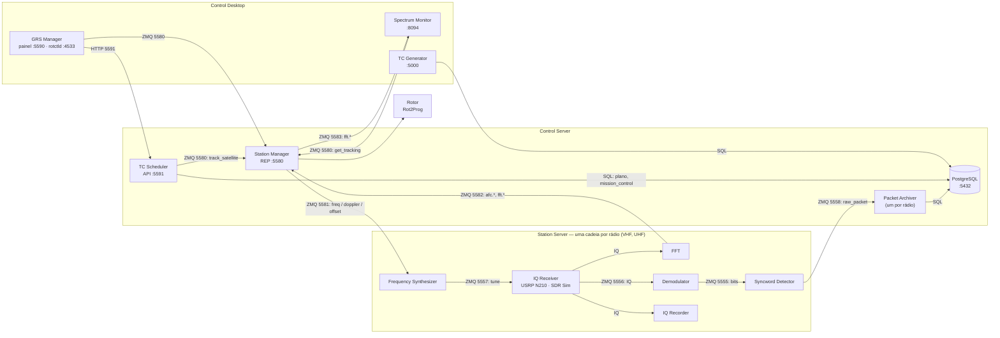

# A estação como ela é hoje

Arquitetura **implementada** da estação terrestre, em outubro de 2026. Os
documentos de proposta desta pasta (visão geral, componentes, implantação,
integração, casos de uso, camadas) descrevem o desenho original do "MGM8", de
julho; o que foi construído diverge dele em pontos importantes, listados no
fim. Na dúvida, vale este documento — e o código de cada repositório.

## Os três segmentos

A nomenclatura do diagrama GRS continua: **Control Desktop** (o que o operador
vê), **Control Server** (decisão e dados) e **Station Server** (RF). Hoje tudo
sobe num só `docker compose`, mas as fronteiras são de rede: cada bloco pode ir
para outra máquina mudando só endereços.



## Quem é dono de quê

| Responsabilidade | Onde mora | Por quê ali |
|---|---|---|
| Satélites e telecomandos; o schema principal do banco | **TC Generator** (fork) | Já existia; o schema não foi copiado para não haver duas fontes de verdade |
| Decidir o que rastrear e quando; escrever o plano; servir o plano | **TC Scheduler** | É o único escritor do banco, e por isso também quem o serve |
| Recepção por satélite, downlinks, decisões do operador, previsão completa | **TC Scheduler**, schema `mission_control` | Tabelas próprias, criadas no boot, sem mexer no schema do TC Generator |
| Apontar o rotor durante a passagem | **Station Manager** | O laço rápido separado do planejamento lento: um replanejamento nunca atrasa o rotor |
| Doppler previsto e ajuste fino (AFC) | **Station Manager** | Ele sabe se há passagem, de que satélite, em que rádio — é a autoridade sobre a sintonia |
| Somar nominal + Doppler + ajuste e sintonizar | **Frequency Synthesizer**, um por rádio | Mora ao lado do receptor; o Station Manager só anuncia |
| Medir onde o sinal chegou | **FFT**, um por rádio | O IQ não atravessa a rede: só a medida e o espectro reduzido |
| IQ → bits → raw packets | **Demodulator**, **Syncword Detector** (forks) | Blocos adotados do `spacelab-ufsc` |
| Guardar os raw packets | **IQ Recorder** (`archive-packets`), tabela `mission_control.raw_packets` | Nada se perde enquanto o decodificador NGHam não existe |
| Mostrar tudo ao operador | **GRS Manager** (sem banco), **Spectrum Monitor** (só lê) | Degradam em vez de falhar: uma passagem não para porque uma tela caiu |

## Uma passagem, do plano ao pacote

```mermaid
sequenceDiagram
    autonumber
    participant TCS as TC Scheduler
    participant SM as Station Manager
    participant SYN as Synthesizer (por rádio)
    participant RX as IQ Receiver
    participant FFT as FFT (por rádio)
    participant CH as Demod → Syncword → Archiver

    Note over TCS: a cada 5 min (ou segundos depois de uma ação do operador):<br/>propaga 24 h, pontua, escolhe passagens sem sobreposição
    TCS->>SM: track_satellite(orbital_data, until, downlinks)
    Note over SM: roteia cada downlink ao rádio da sua faixa
    SM->>SYN: freq.<rádio> (nominal)
    loop a cada tick (1 s) até o LOS
        SM->>SM: az/el → rotor; Doppler para o meio do intervalo
        SM->>SYN: doppler.<rádio>, offset.<rádio>
        SYN->>RX: tune = nominal + Doppler + ajuste
        RX-->>FFT: IQ
        RX-->>CH: IQ
        FFT->>SM: afc.<rádio> (a que distância do centro a rajada chegou)
        Note over SM: integra o ajuste fino (ganho 0,5, passo ≤ 2 kHz, total ≤ 8 kHz)
        CH-->>CH: bits → raw_packet → mission_control.raw_packets (com o rádio)
    end
    TCS->>SM: get_tracking (periódico)
    Note over TCS: depois que o ajuste converge, guarda o erro de oscilador<br/>em satellite_downlinks.measured_offset_hz → "Aplicar" no painel
```

## Os contratos entre repositórios

| Fronteira | Contrato | Documento |
|---|---|---|
| TC Scheduler ↔ Station Manager | ZMQ 5580, `track_satellite` com `OrbitalData.to_json()` | docstring de `src/mgm8/rotor_zmq/server.py` (grs-station-manager) |
| TC Scheduler ↔ TC Generator | Schema do banco | `docs/schema-contract.md` (grs-tc-scheduler) |
| Station Manager → sintetizador | ZMQ 5581, `freq`/`doppler`/`offset` por canal | README do grs-frequency-synthesizer |
| FFT → Station Manager | ZMQ 5582, `afc.<rádio>` e `fft.<rádio>` | README do grs-fft |
| Receptor → demodulador → detector | ZMQ 5556 / 5555 / 5558 | [../rx-datapath.md](../rx-datapath.md), "Os envelopes" |
| Arquivador → banco | `mission_control.raw_packets` | `docs/schema-contract.md` (grs-iq-recorder) |
| Captura de IQ | SigMF | `docs/capture-contract.md` (grs-iq-recorder) |
| Station Manager e TC Scheduler | mesma tag da `spacelab-tracking` | `repos.txt` e `bootstrap.ps1 -Check` |

## Onde o implementado diverge da proposta original

| Proposta (julho) | Implementado |
|---|---|
| Um "MGM8" central que roteia todas as mensagens entre GRS Manager e Station Server | Cada bloco fala direto com quem precisa; o Station Manager cuida de rotor e sintonia, não de roteamento |
| Agendamento, operação autônoma e persistência dentro do MGM8 | Num serviço próprio, o **TC Scheduler**; o Station Manager não tem banco nem HTTP |
| Predição orbital pelo GPredict | Biblioteca própria (`spacelab-tracking`); o rotctld continua na 4533 só para controle manual |
| Schema `station_manager` (UUIDs, sessões autônomas, histórico de conexões) | Não existe. O plano está em `scheduled_passes` (schema do TC Generator) e o resto em `mission_control` |
| PostgreSQL + TimescaleDB, hypertables de telemetria | PostgreSQL puro; telemetria ainda não é decodificada — os raw packets ficam guardados crus |
| Estados e modos da estação (Manual, Autônomo, Degradado, Manutenção) | Não há máquina de estados: a estação é sempre autônoma, e o operador intervém por passagem (pular, forçar) e por satélite (recepção, downlinks) |
| Frequency Synthesizer controlado diretamente pelo MGM8 | Idem, mas por difusão (PUB), um por rádio, com o ajuste fino fechado pelo bloco FFT |
