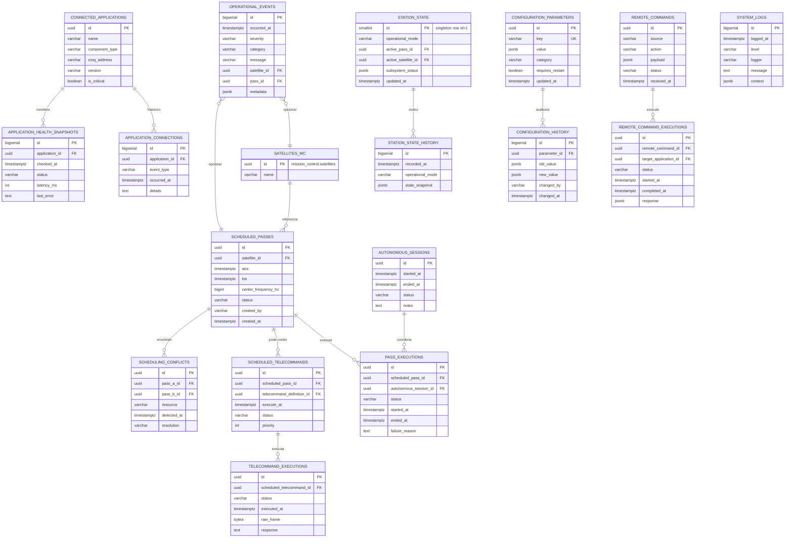

# Modelo de banco de dados — Station Manager

O MGM8 utiliza o PostgreSQL (com TimescaleDB no ecossistema GRS) e define o schema **`station_manager`** para dados operacionais. Dados de telemetria de alta frequência permanecem em `telemetry_stream`; metadados de missão em `mission_control`.

## Diagrama entidade-relacionamento



## Schemas e segregação

| Schema | Propósito | Escrita por |
|--------|-----------|-------------|
| `station_manager` | Operações, agenda, estado, logs operacionais | MGM8 |
| `mission_control` | Dimensões: satélites, pacotes, definições TC | Database / TC Generator |
| `telemetry_stream` | Hypertables de telemetria | Decoders |

## Tabelas — resumo

| Tabela | Tipo | Descrição |
|--------|------|-----------|
| `scheduled_passes` | Dimensão operacional | Passagens de satélite agendadas |
| `pass_executions` | Fato | Execuções reais de passagens |
| `scheduled_telecommands` | Dimensão operacional | TCs agendados |
| `telecommand_executions` | Fato | TCs executados |
| `scheduling_conflicts` | Auditoria | Conflitos detectados |
| `connected_applications` | Registro | Apps monitorados (IQ, rotor, etc.) |
| `application_connections` | Histórico | Conexões/desconexões |
| `application_health_snapshots` | Time-series leve | Health checks periódicos |
| `station_state` | Singleton | Estado atual (1 linha) |
| `station_state_history` | Histórico | Snapshots de estado |
| `configuration_parameters` | Config | Parâmetros operacionais |
| `configuration_history` | Auditoria | Alterações de config |
| `autonomous_sessions` | Sessão | Períodos de operação autônoma |
| `remote_commands` | Comando | Comandos recebidos do GRS |
| `remote_command_executions` | Fato | Execução de comandos remotos |
| `operational_events` | Event log | Eventos operacionais |
| `system_logs` | Log técnico | Logs estruturados do MGM8 |

## Índices principais

- `scheduled_passes (aos, los)` — consultas de agenda e conflitos
- `scheduled_passes (status)` — passagens pendentes
- `scheduled_telecommands (execute_at)` — disparo pelo scheduler
- `operational_events (occurred_at DESC)` — consultas recentes
- `application_health_snapshots (application_id, checked_at DESC)`
- `station_state_history (recorded_at DESC)`

## Script SQL

> **Este documento descreve um design, não o banco em uso.** O script está em
> [`design-original-mgm8.sql`](design-original-mgm8.sql) e nada o executa: o
> schema que a estação realmente usa é o do TC Generator
> (`services/grs-tc-generator/resources/database/schema.sql`), montado pelo
> compose em `/docker-entrypoint-initdb.d/`. As tabelas que o TC Scheduler
> escreve e serve — `satellites`, `telecommands`, `scheduled_passes`,
> `satellite_tracking_status`, `execution_logs` — estão lá, e não aqui.

Se ainda assim quiser aplicar o design original num banco separado:

```bash
psql -U grs -d grs -f docs/database/design-original-mgm8.sql
```

## Valores enumerados

### `operational_mode` (station_state)
`Offline` | `Initializing` | `Idle` | `Manual` | `Autonomous` | `PassActive` | `Degraded` | `Maintenance`

### `pass_status` (scheduled_passes)
`Scheduled` | `Cancelled` | `InProgress` | `Completed` | `Failed` | `Missed`

### `execution_status` (pass_executions, telecommand_executions)
`Pending` | `Started` | `Completed` | `Failed` | `Aborted`

### `health_status` (application_health_snapshots)
`Healthy` | `Degraded` | `Unhealthy` | `Unknown`

### `event_severity` (operational_events)
`DEBUG` | `INFO` | `WARNING` | `ERROR` | `CRITICAL`

## Consultas operacionais comuns

### Passagens nas próximas 24h

```sql
SELECT sp.id, s.name AS satellite, sp.aos, sp.los, sp.status
FROM station_manager.scheduled_passes sp
JOIN mission_control.satellites s ON s.id = sp.satellite_id
WHERE sp.aos BETWEEN now() AND now() + interval '24 hours'
  AND sp.status = 'Scheduled'
ORDER BY sp.aos;
```

### Detectar conflitos de agenda

```sql
SELECT a.id AS pass_a, b.id AS pass_b, a.aos, a.los, b.aos, b.los
FROM station_manager.scheduled_passes a
JOIN station_manager.scheduled_passes b
  ON a.id < b.id
 AND a.status = 'Scheduled'
 AND b.status = 'Scheduled'
 AND a.aos < b.los
 AND b.aos < a.los;
```

### Estado atual da estação

```sql
SELECT operational_mode, subsystem_status, updated_at
FROM station_manager.station_state
WHERE id = 1;
```

## Evolução futura

- Hypertable em `station_state_history` e `application_health_snapshots` se volume crescer
- Particionamento de `operational_events` por mês
- Views materializadas para dashboard Grafana
- Políticas de retenção (ex.: logs > 90 dias → archive)
